# THE POD HOUSE

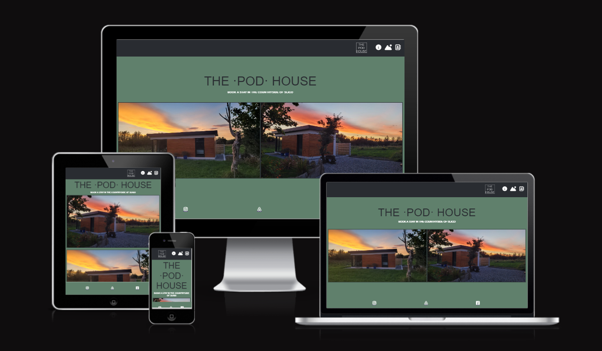

https://aron-m.github.io/SLIGO-POD-HOUSE-RENTAL-MOBILE-FIRST/

THE POD HOUSE is a web page designed to advertise our tiny-house property as short-term holiday rental for tourists who want to explore Sligo North area. The page provides users with relevant information, as well as the option to make a booking for their desired dates of visiting.

## User Experience (UX)
## User Stories

* As user visiting the website I want to be able to find relevant information regarding the looks and features of the property.
* As user visiting website I want to navigate easily through the website.
* As user I want to see landing page and navigate through it.
* As a user I want to learn about what is included when I book a stay, as well as the various activities around the area.
* As user I want to fill in details in a Booking form to succesfully book a short term stay.
* As user I want to fully understand what all is included when I am making a booking.
* As user I want you be able to use map in the LOCATION section.
* As user I want to see a confirmation page after booking a stay.

# Website Goals
* Increase bookings for the property.
* Use the website tool to expand and grow as a business.
* Easy access on all kinds of devices..
* Clear information about the property and services rendered.
* Easily navigated and understood.
* Simple ways to book a short-term stay in the tiny-house.
* Simple ways to find the property on map.
* Landing page to be nice and sleek.
* Easily readable for everyone.
* Form to work correctly.

### Design
#### Colors:

* Colors used on the website are:

* Olive-green #60806c

* Dark-grey #292c31

* White #ffffff;

#### Fonts:

Fonts used on website are Bebas Neue, Oswald and Inter from google fonts. 
Backup fonts is sans-serif if main font cannot be loaded for any reason.

#### Images:

Various images have been used to showcase the property. These images, of both the exterior and interior, were taken personally and shows the user what the property looks like and what they can expect when they choose to make a booking.

Website structure

| Screen size | Breakpoint |
|---|---|
|small   |>= 280px (mobile-first design)|
|medium	 |>= 576px|
|large	 |>= 830px|
|extra large   |>= 1000px|

Back to top

## Technology, Frameworks and Programs used.
### Languages

* HTML

* CSS

#### Frameworks and Programs used.

Google fonts was used to pick and import fonts to my project.

* GitHub

GitHub was used to store my source code by git add . git commit and git push.

* Git

Git was used with GitPod to write down the code and push it to GitHub.

* Screenfly

Testing website.
Features
Responsive on all devices.
Interactive buttons

* Fontawesome

Fontawesome was used to obtain various icons used within the website, such as within the the INCLUDING section as well as THINGS TO DO section of the page.

* Am I Responsive

To test various screen-size responsiveness.

# SECTIONS OF WEBSITE

1. Navigation Bar
2. Home/Landing Page section
3. THE POD images and features section
4. THINGS TO DO section
5. BOOKING FORM section
6. LOCATION/ADDRESS section
7. Footer

## Navigation bar

 - Navigation bar will be mostly the same through out the website, placed on a sticky header at the top, with navigation icons anchored to relevant sections of the page.

    - For mobile devices, Tablets and PC screen sizes, the navigation bar will look the same and keep the same size.

    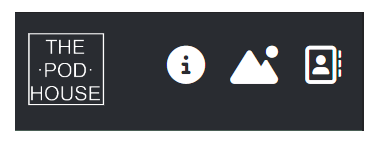

    - ERROR 1 ON TABLET AND PC DEVICES:

     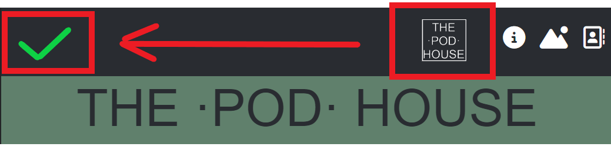

        PLEASE NOTE: ERROR has occured where "THE POD HOUSE" logo does not stick to the left as the dimensions become bigger at tablet and pc display.

    - ERROR 2 ON ALL DEVICES

    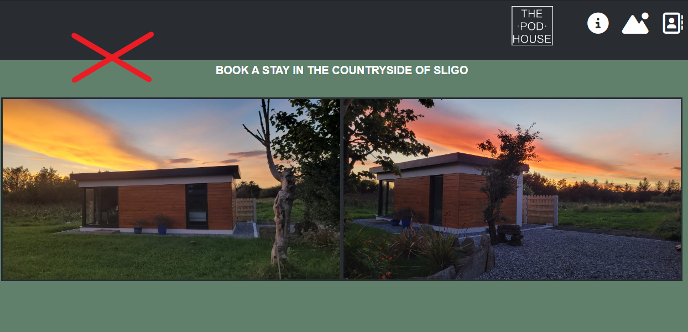

        PLEASE NOTE: ERROR has occured where the sticky-nav bar falls over the intended anchored element, causing the  anchored H1 elements not too display at the top

    - How it should be: 

    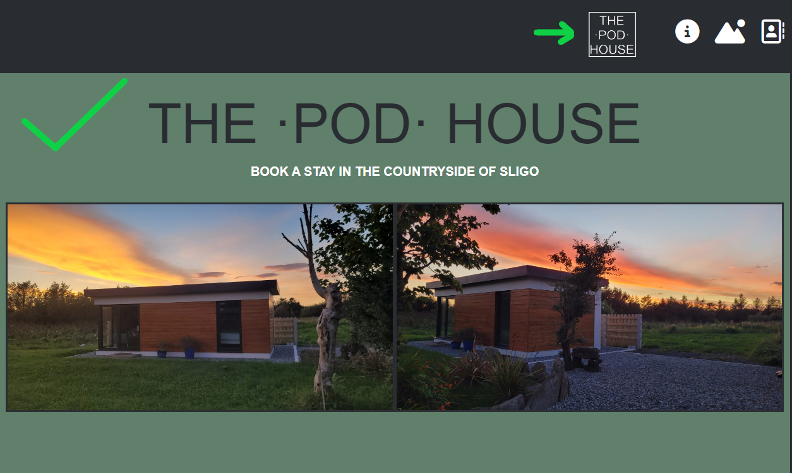    

## Landing Page

* Landing page should show the main header and include some/all (depending on device) of the 2 hero images. This is followed by 2 paragraphs of descriptive text.

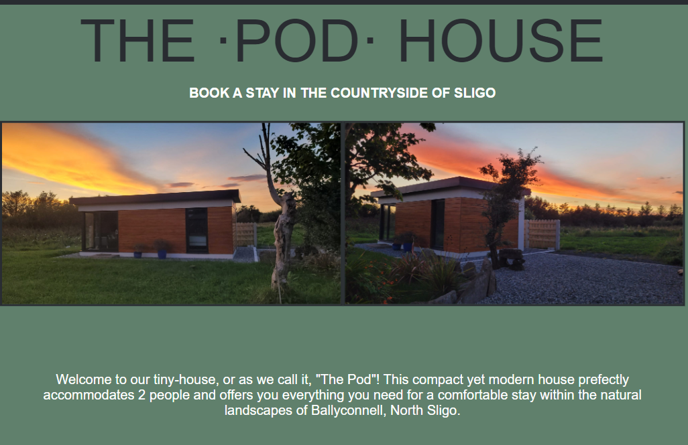

## THE POD Images/features section

-The FEATURES section starts with THE POD header followed by two sub-sections IMAGES and FEATURES, which include 5 images of the tiny-house's interior, followed by a list of features the guests can expect when booking the tiny-house.

### IMAGES SUB-SECTION

* First Image (KITCHEN & LIVING ROOM) is horizontal and acts as mini-hero image for this section. The following images all displays vertically afterwards.

#### FOR MOBILE (280px-576px)
* All images flows top-down starting with 'Kitchen & Living Room' image, ending with 'Shower & Sink'

#### FOR TABLET (576px-830px)
* Mini-hero image stays at the top and the other 4 images are then wrapped to show in rows of 2 each.

#### FOR FULL SCREEN (830px-1000px)

* All images are flexed in a row order stretching from left to right

MOBILE | TABLET | FULL SCREEN 
 :---:|:---:|:---:
  | 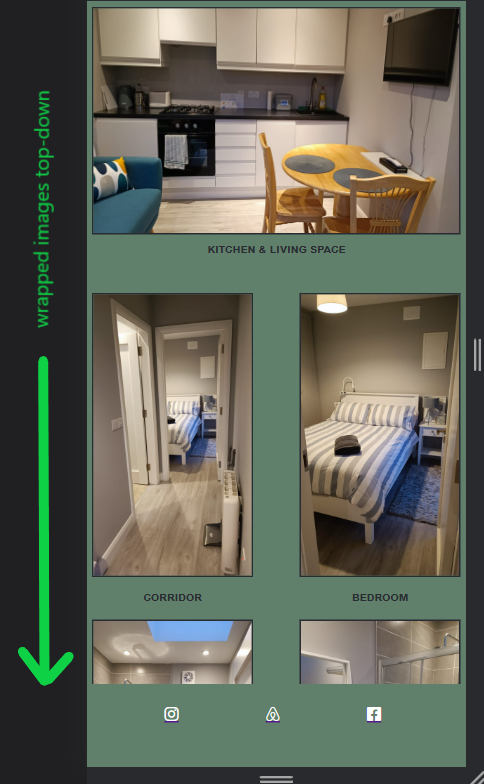 | 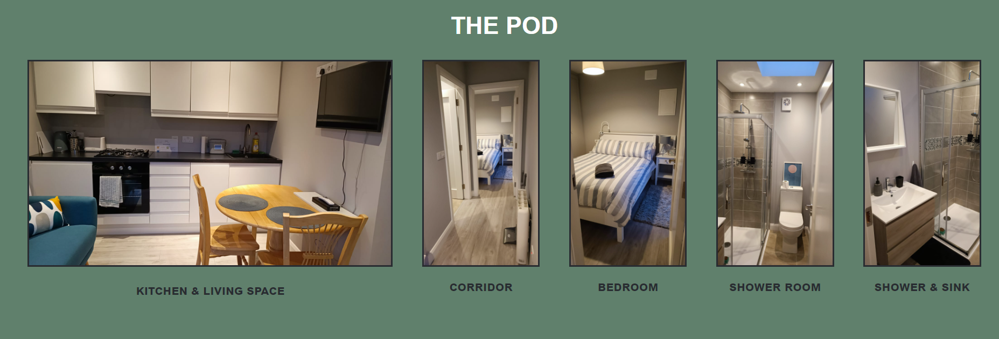

### FEATURES LIST SUB-SECTION

* The FEATURES LIST is the second part of THE POD section. The list includes 6 features, each containing an icon abtained at Fontawesome.

 MOBILE | TABLET | FULL SCREEN 
 :---:|:---:|:---:
 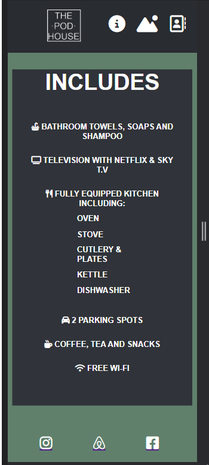 | 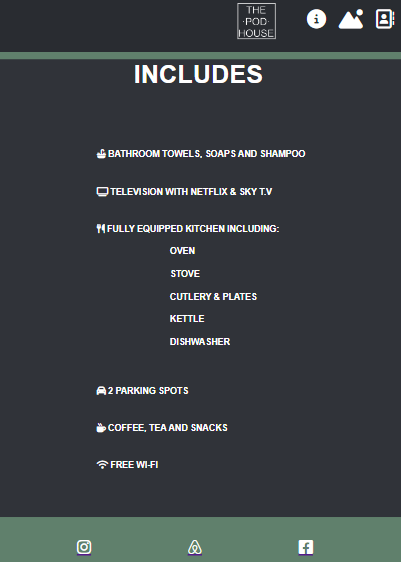 | 

## 'THINGS TO DO' SECTION

This section includes 6 images of various activities and things to do within the nearby area of the tiny-house. This provides information to the user of what they can look forward to doing around the nearby area.

* PLEASE NOTE: These images were sourced from FONTAWESOME and converted to .jpegs due to needing some of the icons' background colour within the icon in order to match the background of the webpgae. I did that by editing the downloaded icon and changing it in MS Paint, and then uploading those .jpegs to the 'assets' folder.

* All images were captioned directly uderneath the image.

MOBILE | TABLET | FULL SCREEN 
 :---:|:---:|:---:
 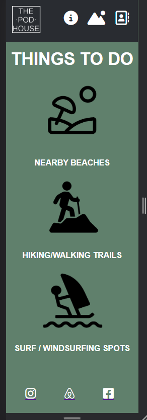 | 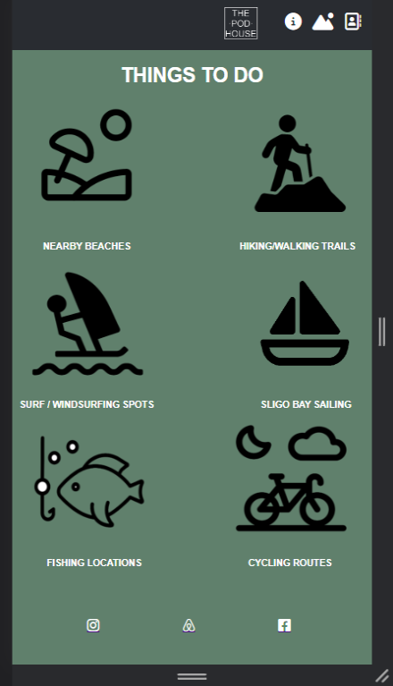 | 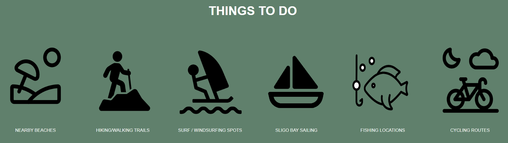

## BOOKING SECTION

#### FOR MOBILE

Booking form is implimented fairly basic, with NAME; EMAIL; DATE FROM; DATE TO; MESSAGE.

#### FOR TABLET

Layout keeps the same design and only stretches out a bit as the screen widens.

#### FOR PC

Layout stays the same, however LOCATION section moves to the right of the form section.

MOBILE | TABLET | FULL SCREEN 
 :---:|:---:|:---:
 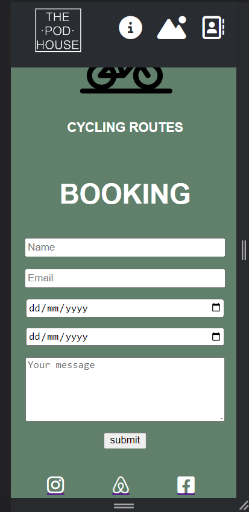 | 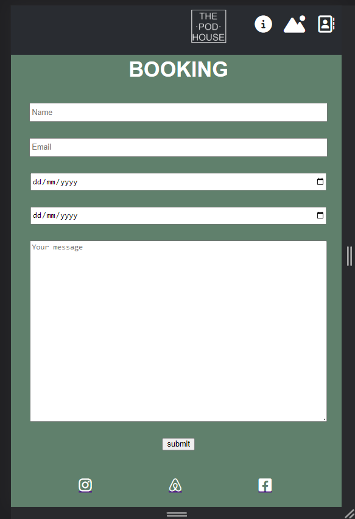 | 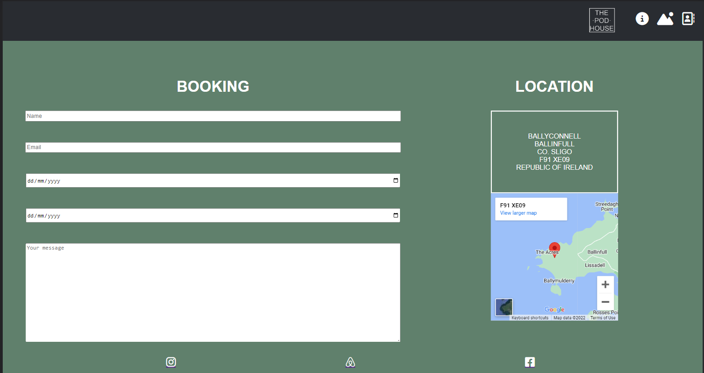

#### BOOKING DISPLAY ERROR:

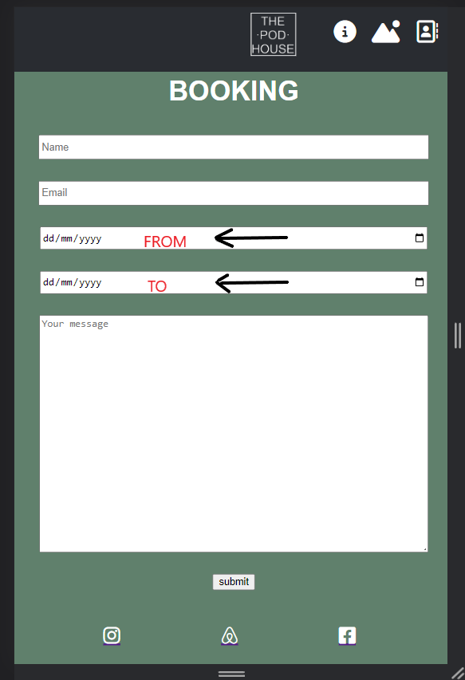

The DATES area should have had clearer directions, and should have been displayed as shown below.

#### FORM:

The form is responsive, with a message indicating that the useer's booking was succesful, and with a button to revert the user back to the main webpage.

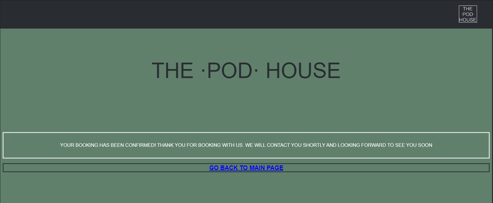

#### FORM DESIGN ERROR:

The design of the form return page is functional, however poorly designed and can be better styled. The return button especially was very hastily done due to time constraints.

## LOCATION SECTION

#### MOBILE

Location section sits right at the bottom, with address attached at the top of the map.
Map was retrieved from Google Maps.

#### TABLET

Location section is at the bottom, hugging the footer, with address attached at the top of the map.

#### FULL SCREEN

Location moves to the right of the row shared with the booking form.

MOBILE | TABLET | FULL SCREEN 
 :---:|:---:|:---:
 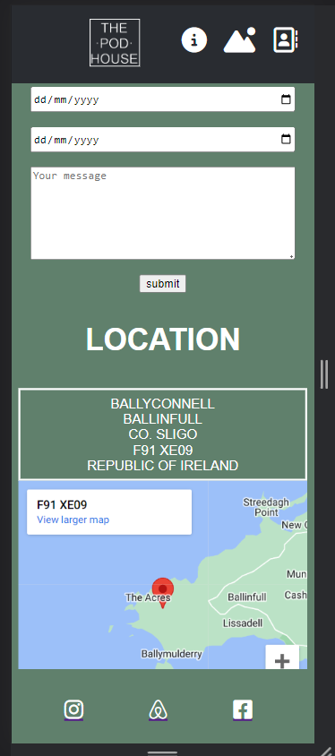 | 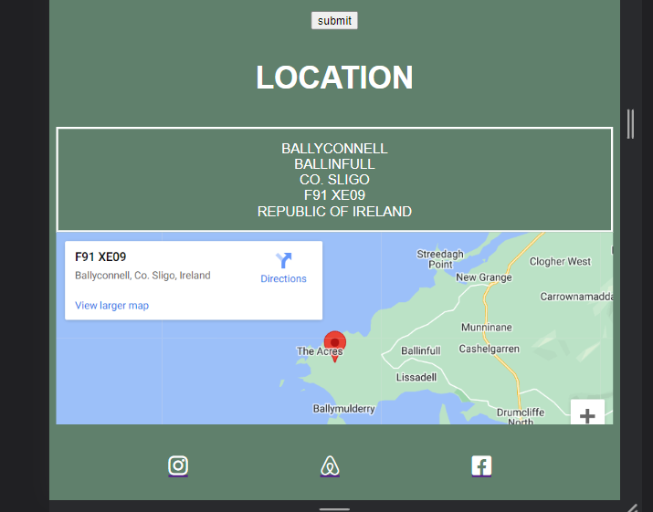 | 

#### FOOTER

Footer has been done styled with the same green background. Social media links have been added, however the links only go to the home pages of each platform.

## KNOWN BUGS

As shown previously, there have been a fair few bugs identified and could not be rectified due to time constraints, namely:

* Sticky nav-bar has 'POD HOUSE' logo that doesn't stick to the left as screen size changes.
* Sticky bar hovers over every H1 anchored to the nav-icon within the sticky header.
* Form dates does not clearly convey 'TO' and 'FROM' information at each bar.
* Form return page is not well designed, and the 'return to main page' button is not styled to look like a button.
* A certain amount of CSS style rules within the code have not been cleaned up. Some style rules can be seen as redundant, overriding and/or unneccessary. 
* Validator errors have not been fixed due to time constraints.

#### VALIDATOR

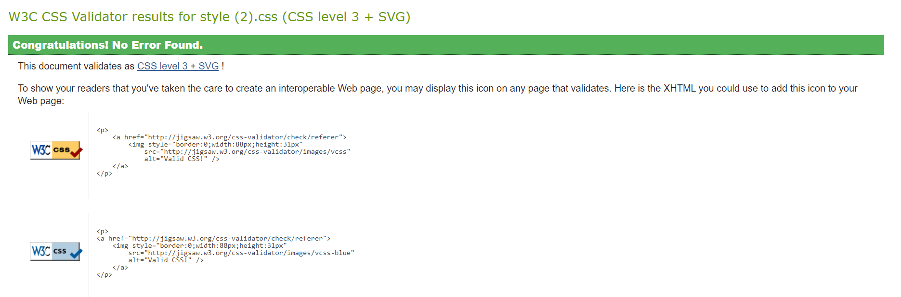

Validator errors, were unfortunately not rectified due to time constraints.

# DISCLAIMER

During the creation of this webpage, I have encountered various learning curves where I have had to pivot and start again from the beginning. To be more specific, it happened twice where I stopped midway through creation to start fresh.

One of the main reasons were to change from full-screen-first to rather start developing from mobile-first.
In doing so, I then started a new repository and copied my old code as I saw fit within the new repository.

Therefore a big percentage of my commit history will not be shown within my final draft.

Here, I have attached the two previous attempts for your perusal. Here you will see the bulk of my previous commits and how the webpage grew from attempt to attempt, with code changing as I learnt better ways to achieve what I wanted to set out for.

#### ATTEMPT 1:

https://aronm-ballyconnellattr-dmo4rqa51ga.ws-eu67.gitpod.io/

#### ATTEMPT 2:

https://aronm-podhouseholidayr-nl656b9zy87.ws-eu67.gitpod.io/

Here you will see the progress of how the site developed, with access to my commit history.

# Deployment
Following writing the code then commiting and pushing to GitHub, this project was deployed using GitHub by the following steps.

1. Navigate to the repository on github and click **Settings**.
2. Then select **Pages** on the side navigation.
3. Select the None dropdown, and then click **Main**.
4. Click on the **Save** button.
5. Now the website is now live on 
6. If any changes are required, they can be done, commited and pushed to GitHub and the changes will be updated.

# Credits:

- Slack Community members such as Mr. Bim, Dave Horrocks, John Traas, Matt Bodden and Daisy_mentor for selflessly helping me with queries and questions.
- [Rohit Sharma](https://github.com/rohit_mentor) My helpful mentor.
- [Simen Daehlin](https://github.com/Eventyret) for helpful Masterclasses.
- [Google Maps](https://www.google.com/maps/) for google maps.
- [screenfly](https://screenfly.org/) for testing my website).
- [Fontawesome](https://fontawesome.com/kits) for icons.
- [The W3C CSS Validation Service](https://jigsaw.w3.org/css-validator/) Validation of CSS.
- [AmIresponsive](https://ui.dev/amiresponsive) for responsive look of my website.

